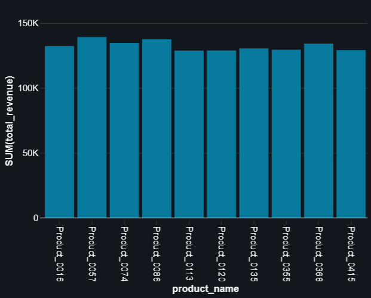
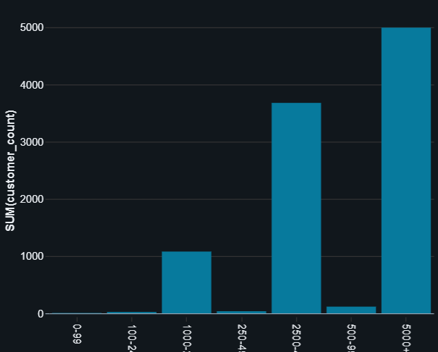
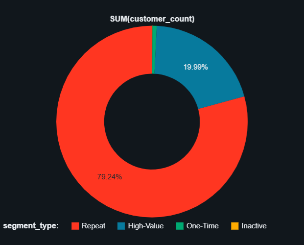
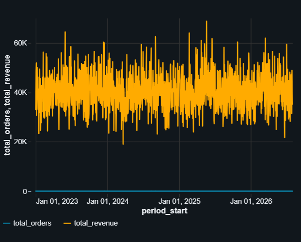

## 1. Sample Queries with Visualizations

Below are the actual queries executed against the Gold layer with their results and visualization configurations.

> **Note:** Interactive visualizations are available in the notebook: [`notebook_ttn_c1_assignment_validaton`](../../notebook_ttn_c1_assignment_validaton) (Cells 31-36). Screenshots of the chart outputs are provided below each query for reference.
(https://dbc-45b81f48-7e70.cloud.databricks.com/editor/notebooks/381239961230379?o=7474659564643909)

### Query 1: Show Gold Tables
```sql
SHOW TABLES IN gold;
```

**Result:** 4 tables
- `customer_segmentation`
- `daily_weekly_trends`
- `revenue_by_customer`
- `sales_by_product`

---

### Query 2: Top 10 Products by Revenue
```sql
SELECT
  product_id,
  product_name,
  category,
  total_orders,
  total_revenue,
  avg_order_value
FROM gold.sales_by_product
ORDER BY total_revenue DESC
LIMIT 10;
```

**Visualization Type:** Bar Chart (Column)
- **X-axis:** `product_name`
- **Y-axis:** `total_revenue`

**Sample Results (Top 3):**
| product_id | product_name | category | total_orders | total_revenue | avg_order_value |
|------------|--------------|----------|--------------|---------------|------------------|
| 57 | Product_0057 | Toys | 163 | 139,204.57 | 854.02 |
| 86 | Product_0086 | Toys | 154 | 137,546.53 | 893.16 |
| 74 | Product_0074 | Toys | 164 | 134,675.76 | 821.19 |

**Chart Output:**


*Screenshot: Bar chart showing top 10 products by revenue with product names on X-axis and revenue on Y-axis*

---

### Query 3: Customer Revenue Distribution (Binned)
```sql
SELECT
  CASE
    WHEN total_revenue < 100 THEN '0-99'
    WHEN total_revenue < 250 THEN '100-249'
    WHEN total_revenue < 500 THEN '250-499'
    WHEN total_revenue < 1000 THEN '500-999'
    WHEN total_revenue < 2500 THEN '1000-2499'
    WHEN total_revenue < 5000 THEN '2500-4999'
    ELSE '5000+'
  END AS revenue_bin,
  COUNT(*) AS customer_count,
  CAST(SUM(total_revenue) AS DECIMAL(18, 2)) AS bin_revenue
FROM gold.revenue_by_customer
GROUP BY
  CASE
    WHEN total_revenue < 100 THEN '0-99'
    WHEN total_revenue < 250 THEN '100-249'
    WHEN total_revenue < 500 THEN '250-499'
    WHEN total_revenue < 1000 THEN '500-999'
    WHEN total_revenue < 2500 THEN '1000-2499'
    WHEN total_revenue < 5000 THEN '2500-4999'
    ELSE '5000+'
  END
ORDER BY MIN(total_revenue);
```

**Visualization Type:** Bar Chart (Column)
- **X-axis:** `revenue_bin`
- **Y-axis:** `customer_count`

**Results (All 7 bins):**
| revenue_bin | customer_count | bin_revenue |
|-------------|----------------|-------------|
| 0-99 | 7 | 469.69 |
| 100-249 | 23 | 4,299.25 |
| 250-499 | 36 | 13,903.91 |
| 500-999 | 116 | 88,772.74 |
| 1000-2499 | 1,079 | 2,024,565.09 |
| 2500-4999 | 3,678 | 14,031,089.05 |
| 5000+ | 4,994 | 36,367,093.86 |

**Total Customers:** 9,933 (verified with `SELECT COUNT(*) FROM gold.revenue_by_customer`)

**Chart Output:**


*Screenshot: Bar chart (histogram) showing customer distribution across revenue bins with bins on X-axis and customer count on Y-axis*

---

### Query 4: Customer Segmentation
```sql
SELECT
  segment_type,
  customer_count,
  avg_revenue,
  total_revenue
FROM gold.customer_segmentation
ORDER BY segment_type;
```

**Visualization Type:** Pie Chart
- **Dimension:** `segment_type`
- **Measure:** `customer_count`

**Results (4 segments):**
| segment_type | customer_count | avg_revenue | total_revenue |
|--------------|----------------|-------------|---------------|
| High-Value | 1,987 | 9,141.76 | 18,164,674.50 |
| Inactive | 7 | 0.00 | 0.00 |
| One-Time | 70 | 697.11 | 48,797.81 |
| Repeat | 7,876 | 4,357.13 | 34,316,721.28 |

**Chart Output:**


*Screenshot: Pie chart showing customer segmentation breakdown by segment type (High-Value, Repeat, One-Time, Inactive)*

---

### Query 5: Daily Revenue Trends
```sql
SELECT period_start, total_orders, total_revenue
FROM gold.daily_weekly_trends
WHERE grain = 'day'
ORDER BY period_start;
```

**Visualization Type:** Line Chart
- **X-axis:** `period_start`
- **Y-axis:** `total_orders`, `total_revenue`

**Results:** 1,309 daily records from 2023-01-01 onwards

**Sample Results (First 5 days):**
| period_start | total_orders | total_revenue |
|--------------|--------------|---------------|
| 2023-01-01 | 50 | 33,034.76 |
| 2023-01-02 | 41 | 36,490.92 |
| 2023-01-03 | 65 | 48,624.97 |
| 2023-01-04 | 57 | 51,865.07 |
| 2023-01-05 | 45 | 30,757.11 |

**Chart Output:**


*Screenshot: Line chart showing daily revenue and order trends over time with date on X-axis and orders/revenue on Y-axis*

---

## 2. Visualization Summary

All queries above have been executed and validated with the following visualizations:

1. ✅ **Top 10 Products** - Bar chart showing revenue by product
2. ✅ **Revenue Distribution** - Bar chart (histogram) showing customer distribution across revenue bins
3. ✅ **Customer Segmentation** - Pie chart showing segment breakdown
4. ✅ **Daily Trends** - Line chart showing orders and revenue over time

These queries form the foundation for a comprehensive e-commerce analytics dashboard.

---

## 3. Adding Chart Screenshots

To complete the documentation, add actual chart screenshots:

1. Open the notebook: [`notebook_ttn_c1_assignment_validaton`](../../notebook_ttn_c1_assignment_validaton)
(https://dbc-45b81f48-7e70.cloud.databricks.com/editor/notebooks/381239961230379?o=7474659564643909)
2. Navigate to cells 31-36 (each contains one of the queries above)
3. Capture screenshots of the visualization output for each cell
4. Save screenshots to: `src/dashboard/screenshots/`
   - `top_10_products_chart.png` (Cell 32 - Bar chart)
   - `revenue_distribution_chart.png` (Cell 33 - Bar chart)
   - `customer_segmentation_chart.png` (Cell 35 - Pie chart)
   - `daily_trends_chart.png` (Cell 36 - Line chart)
5. The markdown image references above will automatically display the screenshots once saved

**Screenshot Tips:**
- Capture the chart area only (exclude cell header/footer)
- Use PNG format for best quality
- Recommended resolution: 800-1200px wide
- Ensure chart titles and axis labels are clearly visible
